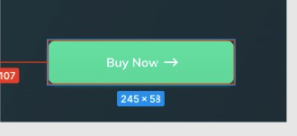

# TASK UI/UX ANALISIS KODE DI FIGMA dan PILGAN

### 1. Button

Dari design tersebut, cobalah tentukan
a. Warna dalam satuan rgb
Jawab: rgb (64, 223, 159), rgb (62, 213, 152);

b. Shadow
Jawab: box-shadow: 0px 2px 4px 0px rgba (15, 218, 137, 0.3);

c. Background
Jawab: linear-gradient (180deg, #40DF9F 0%, #3ED598 100%);

d. Box-shadow
Jawab: 0px 2px 4px rgba (15, 218, 137, 0.3);

e. Border-radius
Jawab: 12px;

### 2. Dari ukuran card yang ada tentukanlah

a. Width : 150px;

b. Height : 210px;

c. Radius : 25px;

### PILGAN FIGMA

