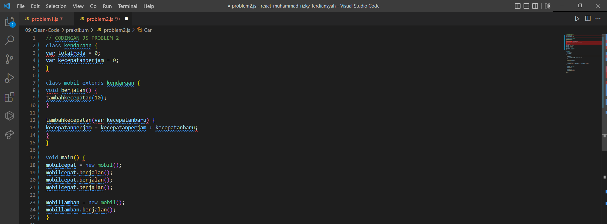

# TASK OUTPUT CLEAN CODE DAN PILGAN

## Objective

- Mampu menuliskan kode yang rapi dan terstruktur

## Challenge

Codingan JS PROBLEM 1

## Problem 1 - Analysis

Kode berikut ini dituliskan tanpa mengikuti kebiasaan-kebiasaan penulisan yang disarankan.

Berapa banyak kekurangan dalam penulisan kode tersebut ?

Bagian mana saja terjadi kekurangan tersebut?

Tuliskan alasan dari tiap kekurangan tersebut!

## Jawaban Problem 1

## Problem 2 - Rewrite

Kode berikut ini dituliskan tanpa mengikuti kebiasaan-kebiasaan penilisan yang disarankan.

Ubahlah penilisan kode berikut menjadi lebih terbaca dan rapi!

CODINGAN JS PROBLEM 2

## Jawaban Problem 2

## node problem 2

## PILGAN CLEAN CODE

