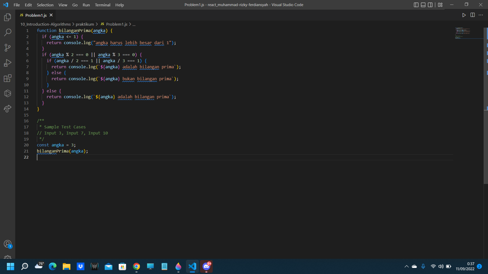
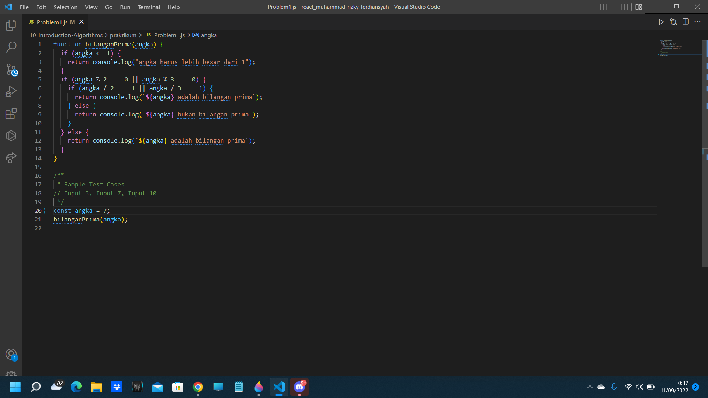
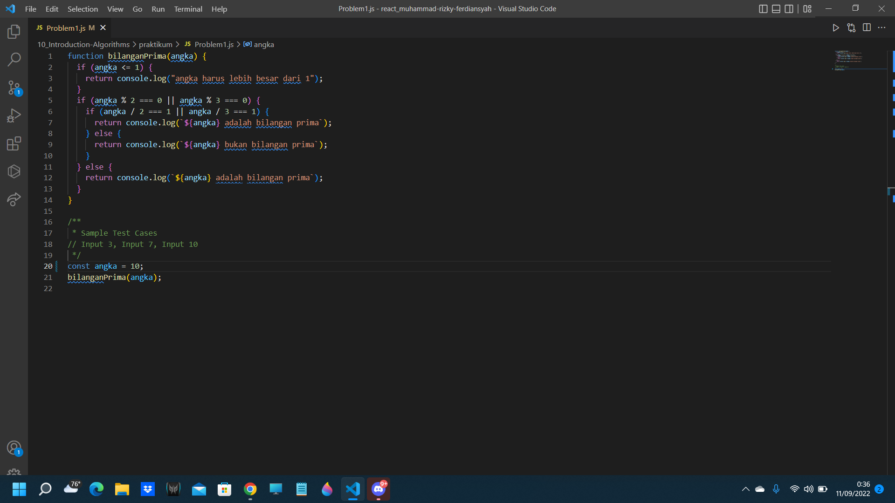

# TASK OUTPUT Introduction to Algorithm dan PILGAN

## Problem 1 - Bilangan Prima (max : 50)

Dalam matematika, bilangan prima adalah bilangan asli yang lebih besar dari angka 1, yang faktor pembaginya adalah 1 dan bilangan itu sendiri. 2 dan 3 adalah bilangan prima. 4 bukan bilangan prima karena 4 bisa dibagi 2. Kamu diminta untuk membuat fungsi untuk menentukan bahwa sebuah bilangan termasuk bilangan prima atau tidak.

### Buatlah flowchart untuk menentukan bilangan prima menggunakan https://whimsical.com!

### Sample Test Cases

Input: 3

Output: Bilangan Prima

## CODINGAN

## NODE

Input: 7

Output: Bilangan Prima

## CODINGAN

## NODE

Input: 10

Output: Bukan Bilangan Prima

## CODINGAN

## NODE

## Problem 2 - Lampu dan Tombol! (max : 50)

Terdapat N tombol yang dinomori dari 1 hingga N dan sebuah lampu dalam keadaan mati. Apabila tombol ke-i ditekan, keadaan lampu akan berubah (dari mati menjadi menyala, atau sebaliknya) jika N habis dibagi oleh i. Apabila masing-masing tombol ditekan tepat sekali,
bagaimana keadaan lampu pada akhirnya?

### Format Masukan

Sebuah baris berisi sebuah bilangan, yaitu N.

### Sebuah baris berisi sebuah bilangan, yaitu N. Format Keluaran Sebuah baris berisi:

• "lampu mati", apabila keadaan akhir lampu adalah mati.

• "lampu menyala", apabila keadaan akhir lampu adalah menyala.

### Buatlah flowchart untuk algoritma tersebut menggunakan https://whimsical.com!

Contoh Masukan

5

## CODINGAN

Contoh Keluaran

lampu mati

## NODE

Contoh Masukan

4

## CODINGAN

Contoh Keluaran

lampu menyala

## NODE

### Penjelasan

Pada contoh pertama, tombol yang mempengaruhi keadaan lampu adalah tombol 1 dan tombol 5. Penekanan tombol 1 mengakibatkan lampu menjadi menyala, dan penekanan tombol 5 mengembalikannya ke keadaan mati.
Pada contoh kedua, tombol yang mempengaruhi keadaan lampu adalah tombol 1, tombol 2, dan tombol 4. Penekanan tombol 1 mengakibatkan lampu menjadi menyala, penekanan tombol 2 mengembalikannya ke keadaan mati, dan penekanan tombol 4 menjadikan lampu kembali menyala.

Contoh Masukan

1

## CODINGAN

Contoh Keluaran

lampu menyala

## NODE

Contoh Masukan

2

## CODINGAN

Contoh Keluaran

lampu mati

## NODE

