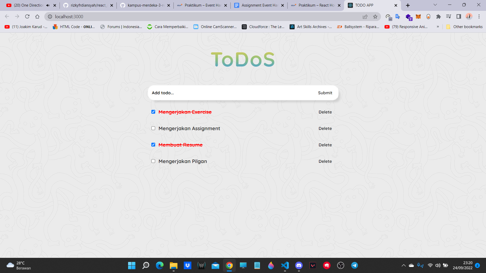

# ASSIGNMENT EVENT HANDLING DAN PILGAN

Buatlah daftar pekerjaan yang akan kamu kerjakan, dengan kriteria sebagai berikut :

1. Daftar pekerjaan dapat ditambahkan menggunakan inputan
2. Terdapat checklist pada setiap daftar pekerjaan
3. Aktifkan checklist jika pekerjaan selesai dikerjakan, seperti contoh dibawah
4. Sertakan tombol hapus untuk menghapus suatu pekerjaan dari daftar pekerjaan
5. Apabila inputan yang anda submit tersebut kosong, tampilkan alert bahwa anda harus mengisi inputan tersebut dahulu sebelum anda submit.

## (\*) Kerapihan dan inovasi menjadi suatu nilai tambah.

## TAMPILAN :

## TAMPILAN ALERT :

## PILGAN

