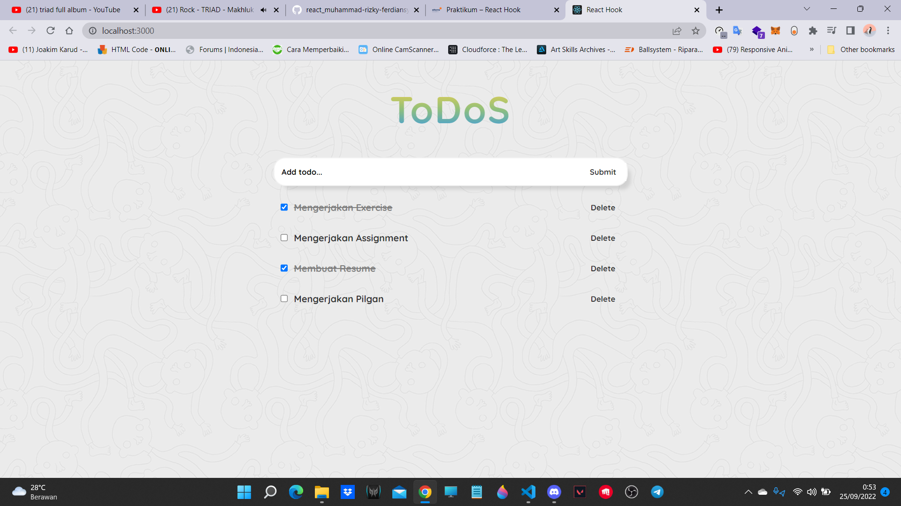

# ASSIGNMENT REACT HOOKS

Ubah Class Component pada assignment sebelumnya menjadi Function Component. Sekaligus ubah lifecycle method & state management menggunakan React Hooks.

## `Berikut merupakan contohnya`

## Data :

Teman-teman bebas dalam membuat bentuk data pada assignment ini. Dibawah ini ada contoh data yang bisa teman-teman pakai :

## TAMPILAN

## TAMPILAN ALERT

## PILGAN

